# Enterprise Customer Risk Prediction System

<p align="center">


</p>

---

## Enterprise-Grade Customer Churn Prediction Using Machine Learning

An end-to-end production-style Machine Learning and MLOps project that predicts customer churn for a telecommunications company. The project demonstrates the complete ML lifecycle, from data ingestion and validation to model training, explainability, REST API deployment, monitoring, and interactive business dashboards.

Designed using modular software engineering principles, the project emphasizes maintainability, scalability, reproducibility, and explainable AI, making it suitable for enterprise environments and ML Engineer portfolios.

---

# Table of Contents

- [Project Overview](#project-overview)
- [Problem Statement](#problem-statement)
- [Business Objectives](#business-objectives)
- [Solution Overview](#solution-overview)
- [Repository Highlights](#repository-highlights)
- [System Architecture](#system-architecture)
- [Technology Stack](#technology-stack)
- [Project Structure](#project-structure)
- [Dataset](#dataset)
- [Machine Learning Pipeline](#machine-learning-pipeline)
- [Feature Engineering](#feature-engineering)
- [Candidate Models](#candidate-models)
- [Model Selection Strategy](#model-selection-strategy)
- [Explainability](#explainability)
- [Generated Artifacts](#generated-artifacts)
- [Model Performance](#model-performance)
- [REST API](#rest-api)
- [Streamlit Dashboard](#streamlit-dashboard)
- [Docker Deployment](#docker-deployment)
- [Installation](#installation)
- [Running the Project](#running-the-project)
- [Testing](#testing)
- [Future Improvements](#future-improvements)
- [License](#license)
- [Author](#author)

---

# Project Overview

Customer churn is one of the most significant challenges faced by subscription-based businesses. Acquiring new customers is considerably more expensive than retaining existing ones, making early identification of high-risk customers essential for maximizing customer lifetime value.

This project develops a complete Machine Learning solution capable of predicting customer churn risk before customers leave. Beyond predictive modeling, the system focuses on explainability, business interpretability, monitoring, and deployment using modern MLOps practices.

The repository demonstrates an end-to-end production workflow including:

- Data validation
- Data preprocessing
- Feature engineering
- Multiple model training
- Automated model comparison
- Explainability-aware model selection
- Threshold optimization
- SHAP explainability
- REST API deployment
- Interactive Streamlit dashboard
- Prediction monitoring
- Docker containerization

---

# Problem Statement

Customer attrition directly impacts revenue, profitability, and long-term business growth.

The objective of this project is to build an intelligent decision-support system capable of identifying customers with a high probability of churn before cancellation occurs.

### Business Problem

- High customer acquisition costs
- Increasing churn rate
- Limited visibility into churn drivers
- Difficulty prioritizing retention campaigns

### Machine Learning Problem

**Problem Type**

Binary Classification

**Target Variable**

Churn


**Prediction Output**

- Churn Prediction
- Churn Probability
- Risk Band
- Top Risk Drivers

---

# Business Objectives

- Reduce customer churn
- Improve customer retention
- Enable proactive intervention
- Increase customer lifetime value
- Support data-driven decision making
- Improve marketing efficiency
- Prioritize high-risk customers
- Provide explainable predictions

---

# Solution Overview

The project follows a complete Machine Learning lifecycle.

```

Raw Dataset
│
▼
Data Validation
│
▼
Data Preprocessing
│
▼
Feature Engineering
│
▼
Model Training
│
▼
Model Evaluation
│
▼
Threshold Optimization
│
▼
Explainability Analysis
│
▼
Model Selection
│
▼
REST API
│
▼
Streamlit Dashboard
│
▼
Business Users

```

---

# Repository Highlights

- End-to-end Machine Learning pipeline
- Modular project architecture
- Production-ready codebase
- Explainability-aware model deployment
- Automatic threshold optimization
- Multiple model benchmarking
- SHAP explainability
- FastAPI REST API
- Streamlit dashboard
- Batch prediction support
- Executive risk summary
- Prediction monitoring
- Model metadata generation
- Docker deployment
- Unit testing using Pytest

---

# Key Features

| Feature | Status |
|----------|--------|
| Data Validation | ✅ |
| Feature Engineering | ✅ |
| Multiple ML Models | ✅ |
| Threshold Optimization | ✅ |
| Model Comparison | ✅ |
| SHAP Explainability | ✅ |
| FastAPI Deployment | ✅ |
| Streamlit Dashboard | ✅ |
| Batch Prediction | ✅ |
| Monitoring Dashboard | ✅ |
| Executive Risk Summary | ✅ |
| Docker Support | ✅ |
| Unit Testing | ✅ |

---

# System Architecture

<p align="center">
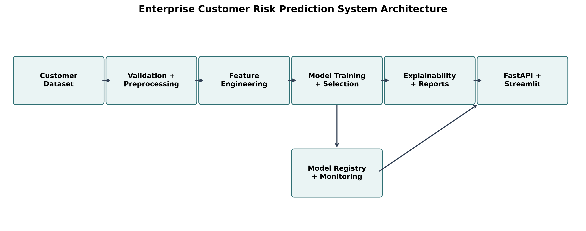
</p>

---

# Project Workflow

<p align="center">
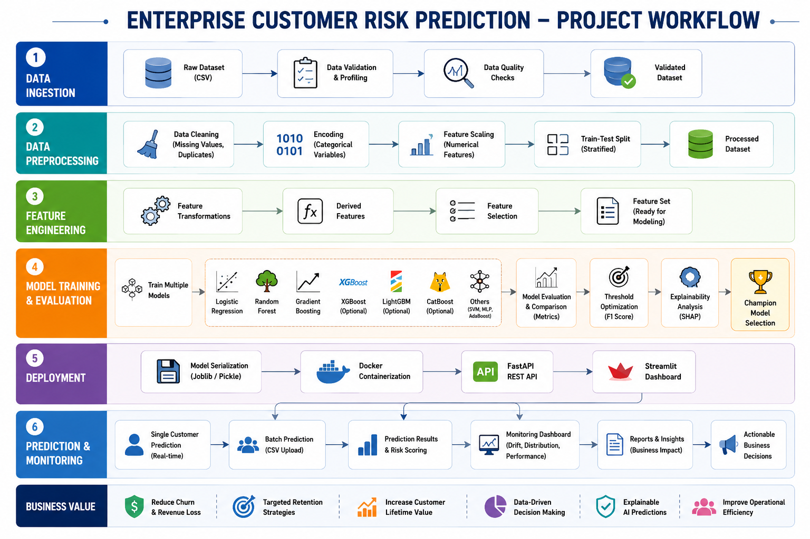
</p>

---

# Technology Stack

| Category | Technologies |
|------------|--------------|
| Programming Language | Python 3.11 |
| Machine Learning | Scikit-learn |
| Additional Models | XGBoost, LightGBM, CatBoost |
| Data Processing | Pandas, NumPy |
| Data Visualization | Matplotlib |
| Explainability | SHAP |
| REST API | FastAPI |
| Dashboard | Streamlit |
| Containerization | Docker, Docker Compose |
| Serialization | Joblib |
| Testing | Pytest |
| Reporting | ReportLab |
| Configuration | PyYAML, python-dotenv |

---

# Software Architecture

```
                    Enterprise Customer Risk Prediction
                                   │
                                   ▼
                      Raw Customer Dataset (CSV)
                                   │
                                   ▼
                   Data Validation & Data Profiling
                                   │
                                   ▼
                        Data Preprocessing Pipeline
                                   │
                                   ▼
                          Feature Engineering
                                   │
                                   ▼
                    Train & Evaluate Multiple Models
                                   │
       ┌───────────────┬────────────────┬────────────────┐
       │               │                │                │
       ▼               ▼                ▼                ▼
 Logistic         Random Forest   Gradient Boosting   Others
 Regression     (Tree-Based ML)   (Ensemble ML)      (XGBoost,
                                                     LightGBM,
                                                     CatBoost,
                                                     AdaBoost,
                                                     SVM,
                                                     MLP)
       └──────────────────────┬────────────────────────┘
                              ▼
                  Model Evaluation & Comparison
                              │
                              ▼
                  Explainability-Aware Champion Selection
                              │
                              ▼
                  Trained Production Model
                              │
                  ┌───────────┴─────────────┐
                  ▼                         ▼
                  FastAPI REST API      Streamlit Dashboard
                  │                         │
                  ▼                         ▼
            Real-Time Predictions    Business Analytics
                  └───────────┬─────────────┘
                              ▼
                  Prediction Monitoring & Reporting
```

---


# Technology Overview

| Layer | Technology |
|--------|------------|
| Data Storage | CSV |
| Backend | Python |
| ML Framework | Scikit-learn |
| Gradient Boosting | XGBoost, LightGBM, CatBoost |
| Explainability | SHAP |
| API | FastAPI |
| Frontend | Streamlit |
| Containerization | Docker |
| Testing | Pytest |

---

# Project Status

| Component | Status |
|------------|--------|
| Data Pipeline | ✅ Complete |
| Feature Engineering | ✅ Complete |
| Model Training | ✅ Complete |
| Explainability | ✅ Complete |
| Monitoring | ✅ Complete |
| REST API | ✅ Complete |
| Dashboard | ✅ Complete |
| Docker | ✅ Complete |
| Testing | ✅ Complete |
| Documentation | 🚧 In Progress |

---


# Project Structure

```

Enterprise-Customer-Risk-Prediction/
│
├── api/                        
│   ├── routes/                 
│   ├── schemas/                
│   ├── services/               
│   └── app.py
│
├── configs/                    
│
├── data/
│   ├── raw/
│   └── sample/
│
├── docker/
│
├── models/
│   └── trained/
│       ├── model.pkl
│       ├── model_metadata.json
│       └── preprocessing.pkl
│
├── notebooks/
│
├── reports/
│   ├── figures/
│   ├── metrics/
│   └── monitoring/
│
├── scripts/
│
├── src/
│   ├── config/
│   ├── data/
│   ├── explainability/
│   ├── features/
│   ├── models/
│   ├── monitoring/
│   ├── pipelines/
│   └── utils/
│
├── tests/
│
├── ui/
│   ├── assets/
│   ├── components/
│   ├── pages/
│   ├── views/
│
├── docker.ignore
├── .gitignore
├── docker-compose.yml
├── LICENSE
├── pyproject.toml
├── README.md
├── requirements-dev.txt
├── requirements-docker.txt
├── requirements-lock.txt
└── requirements.txt
```

---

# Dataset

## Source

IBM Telco Customer Churn Dataset

## Dataset Summary

| Property | Value |
|----------|-------|
| Problem Type | Binary Classification |
| Industry | Telecommunications |
| Records | 7,043 Customers |
| Features | Customer Demographics, Services, Billing |
| Target Variable | Churn |

---

# Input Features

### Customer Information

- Gender
- Senior Citizen
- Partner
- Dependents

### Account Information

- Tenure
- Contract Type
- Payment Method
- Paperless Billing

### Services

- Phone Service
- Multiple Lines
- Internet Service
- Online Security
- Online Backup
- Device Protection
- Tech Support
- Streaming TV
- Streaming Movies

### Financial Information

- Monthly Charges
- Total Charges
- Customer Lifetime Value (CLTV)

### Geographic Information

- Latitude
- Longitude

---

# Data Validation

The training pipeline validates the dataset before model training.

Validation checks include:

- Missing values
- Duplicate records
- Invalid target labels
- Feature consistency
- Schema validation
- Data type verification
- Numerical range validation

---

# Data Preprocessing

The preprocessing pipeline performs:

- Missing value handling
- Feature encoding
- Numerical scaling (where required)
- Column transformations
- Feature selection
- Data splitting

---

# Feature Engineering

Engineered features improve model performance while maintaining interpretability.

The pipeline includes:

- Categorical encoding
- Numerical transformations
- Business-friendly feature naming
- Feature metadata generation
- Pipeline serialization

---

# Machine Learning Pipeline

The automated pipeline performs the following sequence:

```text
                        Load Dataset
                              │
                              ▼
                        Validate Dataset
                              │
                              ▼
                        Clean Data
                              │
                              ▼
                        Preprocess Features
                              │
                              ▼
                        Feature Engineering
                              │
                              ▼
                        Train/Test Split
                              │
                              ▼
                        Train Candidate Models
                              │
                              ▼
                        Threshold Optimization
                              │
                              ▼
                        Model Evaluation
                              │
                              ▼
                        Explainability Analysis
                              │
                              ▼
                        Champion Model Selection
                              │
                              ▼
                        Save Model & Metadata
                              │
                              ▼
                        Generate Reports
```

---

# Candidate Models

The pipeline benchmarks multiple supervised learning algorithms.

| Model | Included |
|--------|----------|
| Logistic Regression | ✅ |
| Random Forest | ✅ |
| Extra Trees | ✅ |
| Gradient Boosting | ✅ |
| HistGradientBoosting | ✅ |
| AdaBoost | ✅ |
| Support Vector Machine | ✅ |
| Multi-layer Perceptron | ✅ |
| XGBoost | ✅ |
| LightGBM | ✅ |
| CatBoost | ✅ |

---

# Model Evaluation

Each candidate model is evaluated using multiple classification metrics.

## Evaluation Metrics

- Accuracy
- Precision
- Recall
- F1 Score
- ROC-AUC
- Precision-Recall Curve
- Confusion Matrix

---

# Threshold Optimization

Instead of using the default probability threshold of **0.50**, the pipeline automatically identifies the threshold that maximizes the F1 Score.

Benefits include:

- Better precision-recall balance
- Improved business decision making
- Higher customer retention effectiveness

---

# Explainability-Aware Model Selection

The deployment model is not selected solely on predictive performance.

Selection strategy:

1. Rank models by F1 Score and ROC-AUC.
2. Select models within the configured tolerance.
3. Prefer an explainable tree-based model when available.
4. Otherwise deploy the highest-performing model.

This approach balances:

- Predictive performance
- Model transparency
- SHAP compatibility
- Business interpretability

---

# Explainability

The project integrates SHAP to explain both global and individual predictions.

Capabilities include:

- Global feature importance
- Local customer explanations
- SHAP Summary Plot
- SHAP Waterfall Plot
- Top risk driver extraction

---

## Global Feature Importance

<p align="center">
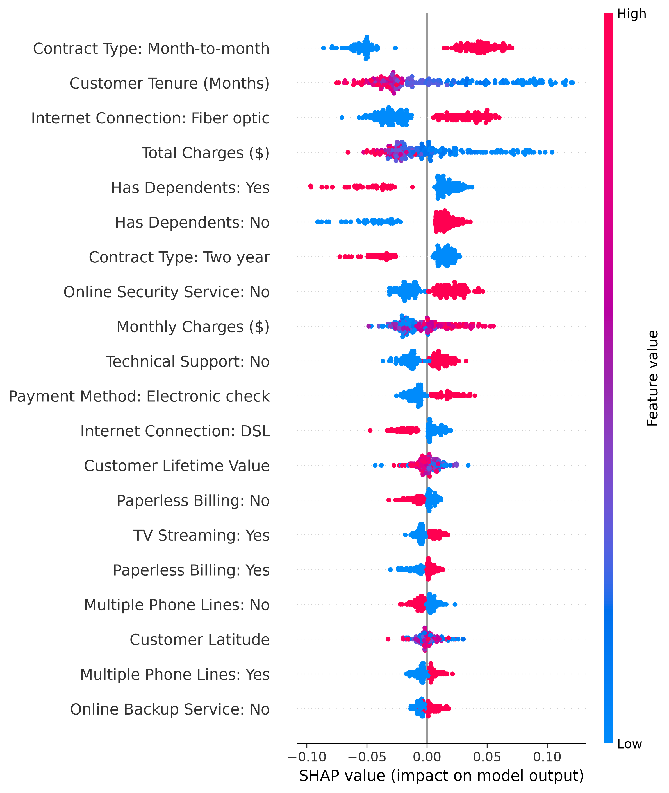
</p>

---

## Individual Prediction Explanation

<p align="center">
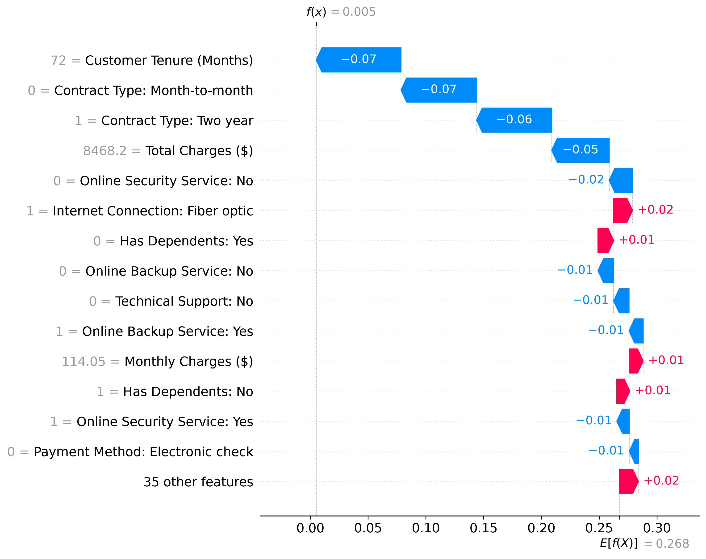
</p>

---

# Model Monitoring

Prediction monitoring supports production readiness.

Generated monitoring reports include:

- Prediction distribution
- Risk distribution
- Confidence distribution
- Feature importance
- Calibration analysis
- Executive risk summary

---

# Generated Artifacts

Running the training pipeline automatically generates the following artifacts.

## Trained Models

```text
models/trained/

model.pkl
model_<timestamp>.pkl
model_metadata.json
preprocessing.pkl
```

---

## Metrics

```text
reports/metrics/

metrics.json
model_comparison.json
business_impact.json
feature_importance.json
confusion_matrix.json
```

---

## Figures

```text
reports/figures/

model_comparison.png
roc_curve.png
precision_recall_curve.png
calibration_curve.png
confusion_matrix.png
feature_importance.png
shap_summary.png
shap_customer_0.png
```

---

## Monitoring

```text
reports/monitoring/

prediction_log.csv
reference_profile.json
monitoring_summary.json
```

---

# Model Performance

The pipeline automatically produces the following reports after every training run.

| Report | Generated |
|---------|-----------|
| Model Comparison | ✅ |
| Threshold Optimization | ✅ |
| ROC Curve | ✅ |
| Precision-Recall Curve | ✅ |
| Confusion Matrix | ✅ |
| Feature Importance | ✅ |
| Business Impact Report | ✅ |
| SHAP Summary | ✅ |
| SHAP Waterfall | ✅ |
| Model Metadata | ✅ |
| Monitoring Report | ✅ |

---

## Model Comparison

<p align="center">
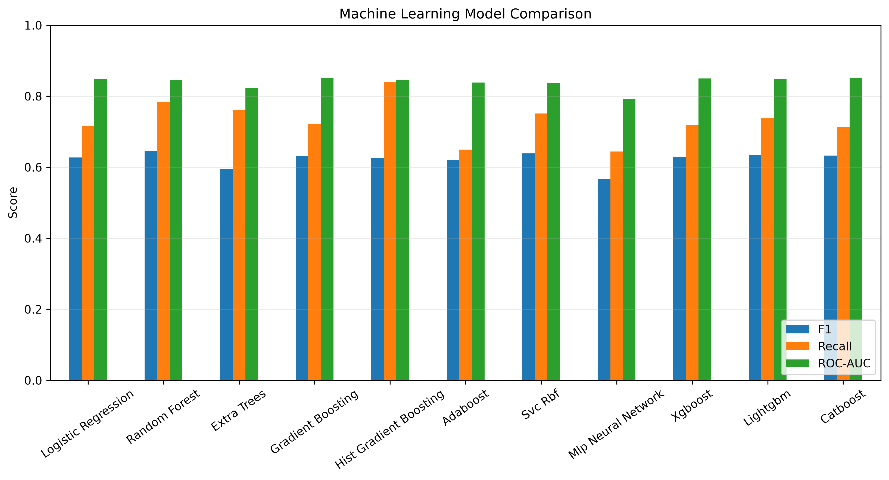
</p>

---

## ROC Curve

<p align="center">
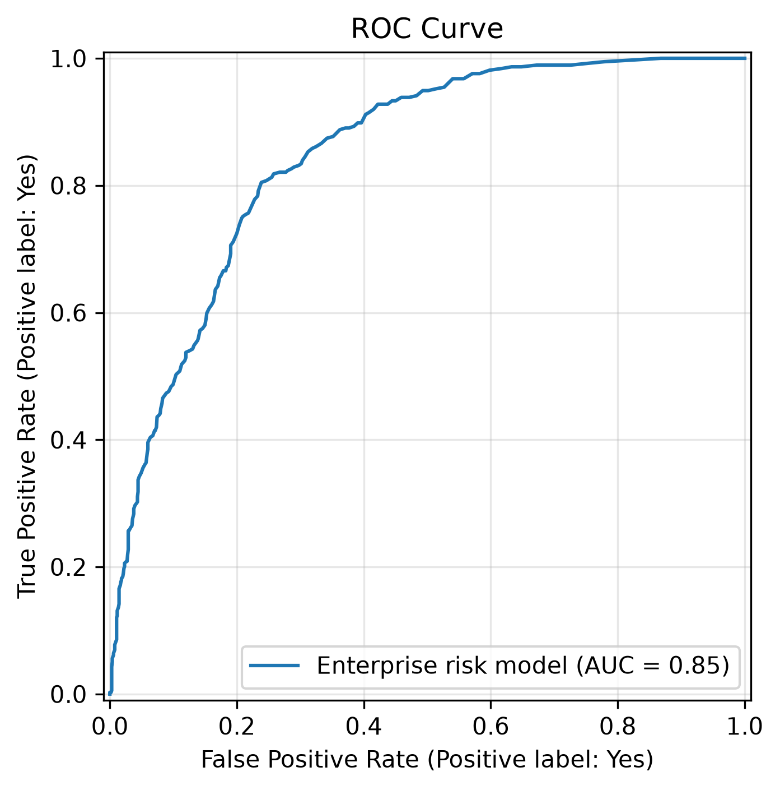
</p>

---

## Precision–Recall Curve

<p align="center">
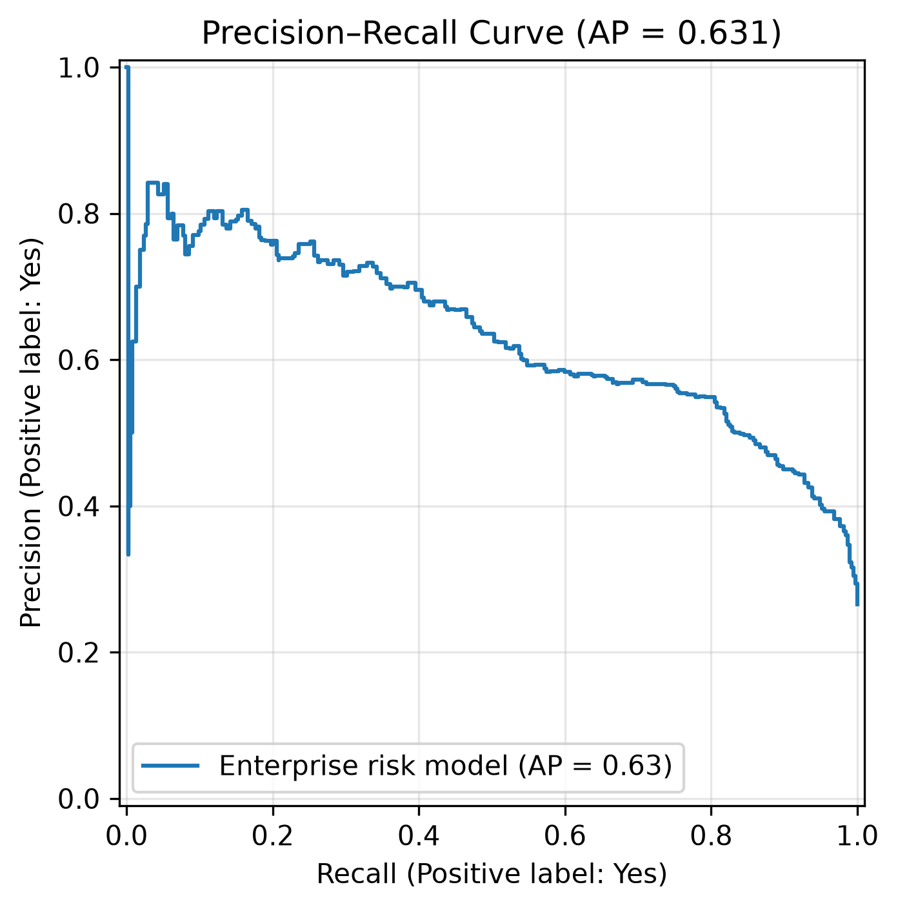
</p>

---

## Confusion Matrix

<p align="center">
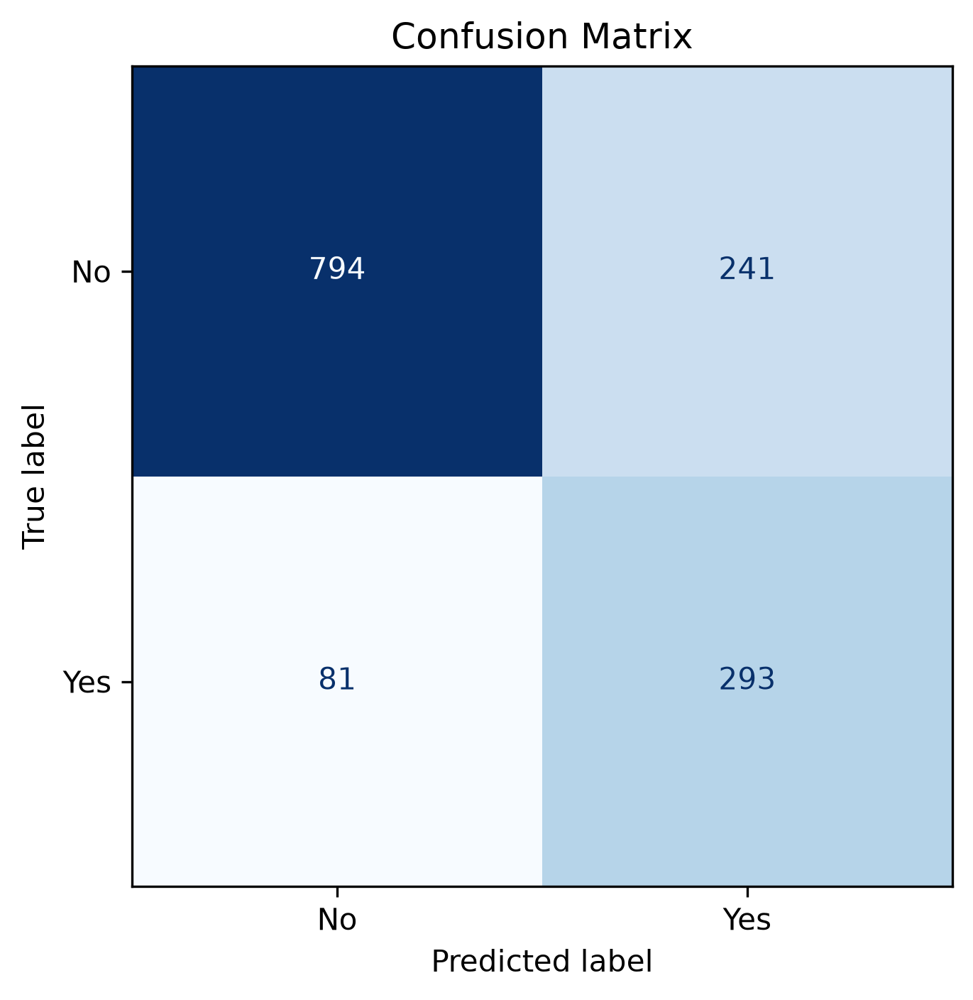
</p>

---

## Calibration Curve

<p align="center">
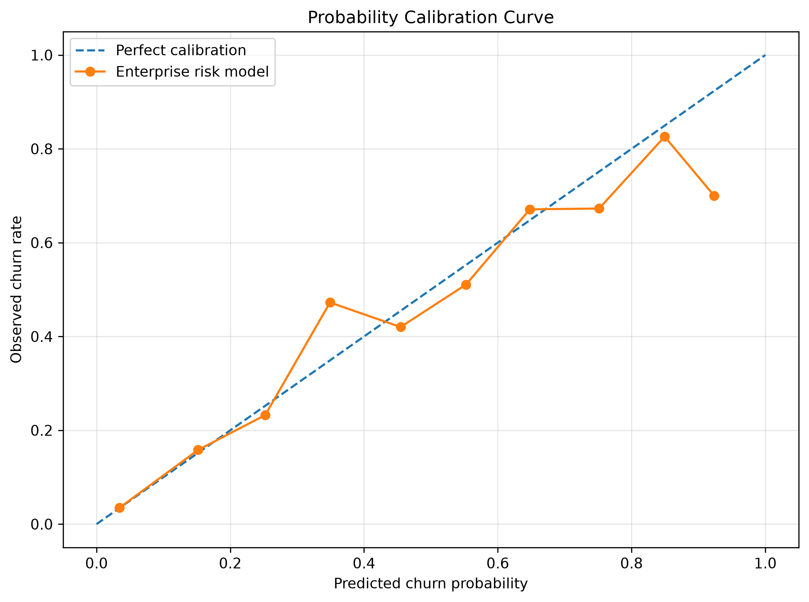
</p>


---

# REST API

The project exposes prediction services through **FastAPI**, enabling real-time and batch customer churn prediction.

## Available Endpoints

| Method | Endpoint | Description |
|---------|----------|-------------|
| GET | `/` | API Information |
| GET | `/health` | Health Check |
| GET | `/model` | Model Metadata |
| POST | `/predict` | Single Customer Prediction |
| POST | `/batch-predict` | Batch Prediction |

---

## Swagger Documentation

```
http://localhost:8000/docs
```

<p align="center">
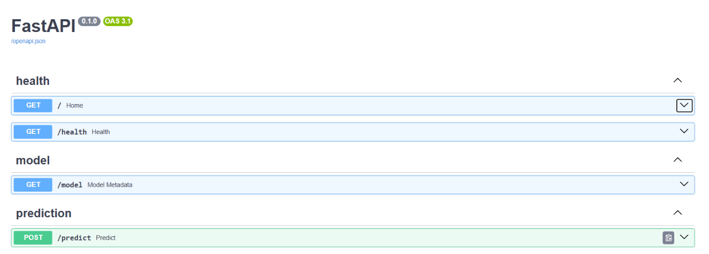
</p>

---

## Example Prediction Request

```json
{
  "records": [
    {
      "Latitude": 28.6139,
      "Longitude": 77.2090,
      "Gender": "Male",
      "Senior Citizen": "Yes",
      "Partner": "Yes",
      "Dependents": "Yes",
      "Tenure Months": 84,
      "Phone Service": "Yes",
      "Multiple Lines": "Yes",
      "Internet Service": "Fiber optic",
      "Online Security": "Yes",
      "Online Backup": "Yes",
      "Device Protection": "Yes",
      "Tech Support": "Yes",
      "Streaming TV": "Yes",
      "Streaming Movies": "No",
      "Contract": "Two year",
      "Paperless Billing": "Yes",
      "Payment Method": "Credit card",
      "Monthly Charges": 118.75,
      "Total Charges": 9728.50,
      "CLTV": 9860
    }
  ]
}

```

---

## Example Prediction Response

```json
{
  "predictions": [
    {
      "prediction": "No",
      "churn_probability": 0.05,
      "risk_band": "Low",
      "risk_drivers": [
        {
          "feature": "Contract",
          "display_name": "Contract Type",
          "value": "Two year",
          "importance": 0.126722,
          "importance_percent": 12.67
        },
        {
          "feature": "Tenure Months",
          "display_name": "Customer Tenure (Months)",
          "value": "84",
          "importance": 0.092936,
          "importance_percent": 9.29
        },
        {
          "feature": "Total Charges",
          "display_name": "Total Charges ($)",
          "value": "9728.5",
          "importance": 0.090463,
          "importance_percent": 9.05
        },
        {
          "feature": "Monthly Charges",
          "display_name": "Monthly Charges ($)",
          "value": "118.75",
          "importance": 0.07578,
          "importance_percent": 7.58
        },
        {
          "feature": "CLTV",
          "display_name": "Customer Lifetime Value",
          "value": "9860",
          "importance": 0.071363,
          "importance_percent": 7.14
        }
      ]
    }
  ]
}

```

---

# Streamlit Dashboard

The Streamlit application provides an interactive interface for business users, analysts, and decision makers.

## Dashboard Modules

- Homepage
- Model Prediction 
- Batch Scoring
- Model Explainability
- Model Monitoring 

---

## Homepage

<p align="center">
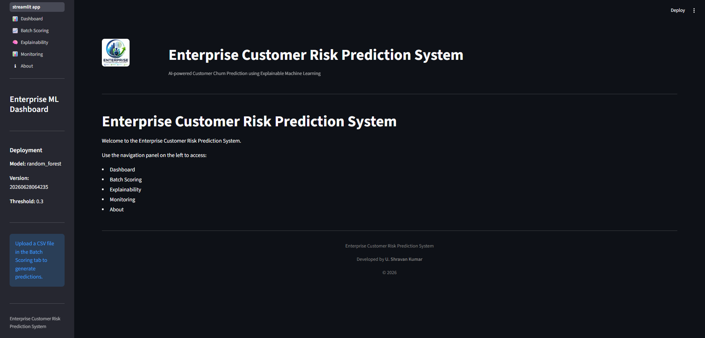
</p>

---

## Model Prediction

<p align="center">
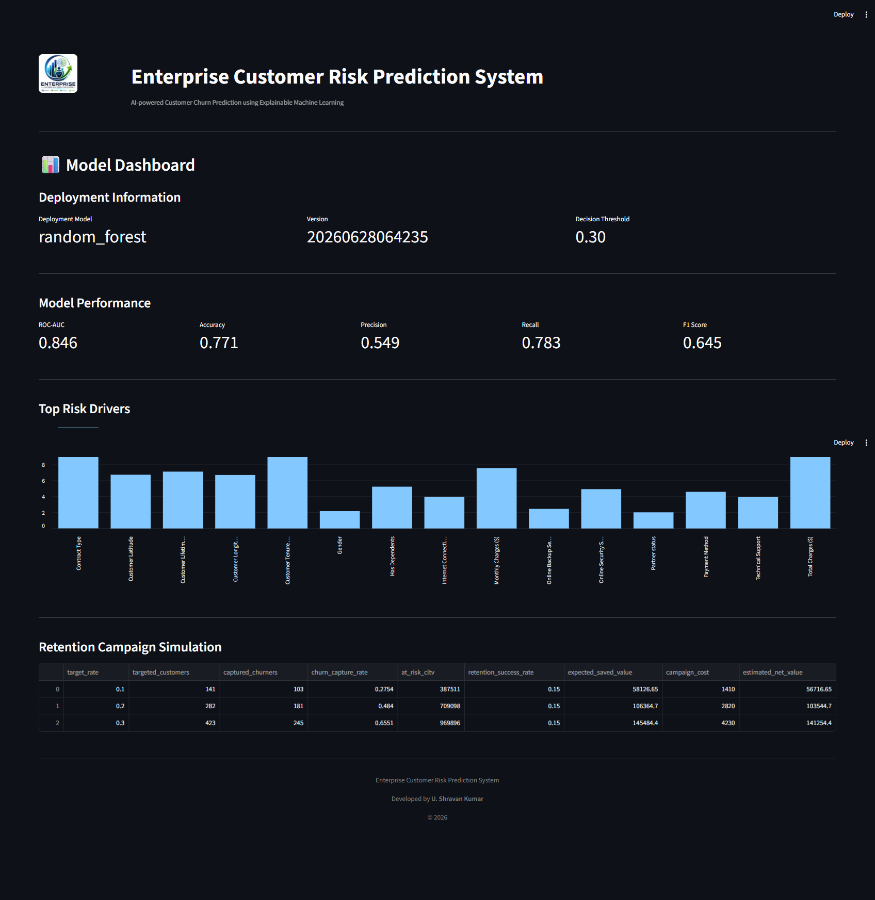
</p>

---

## Batch Scoring

<p align="center">
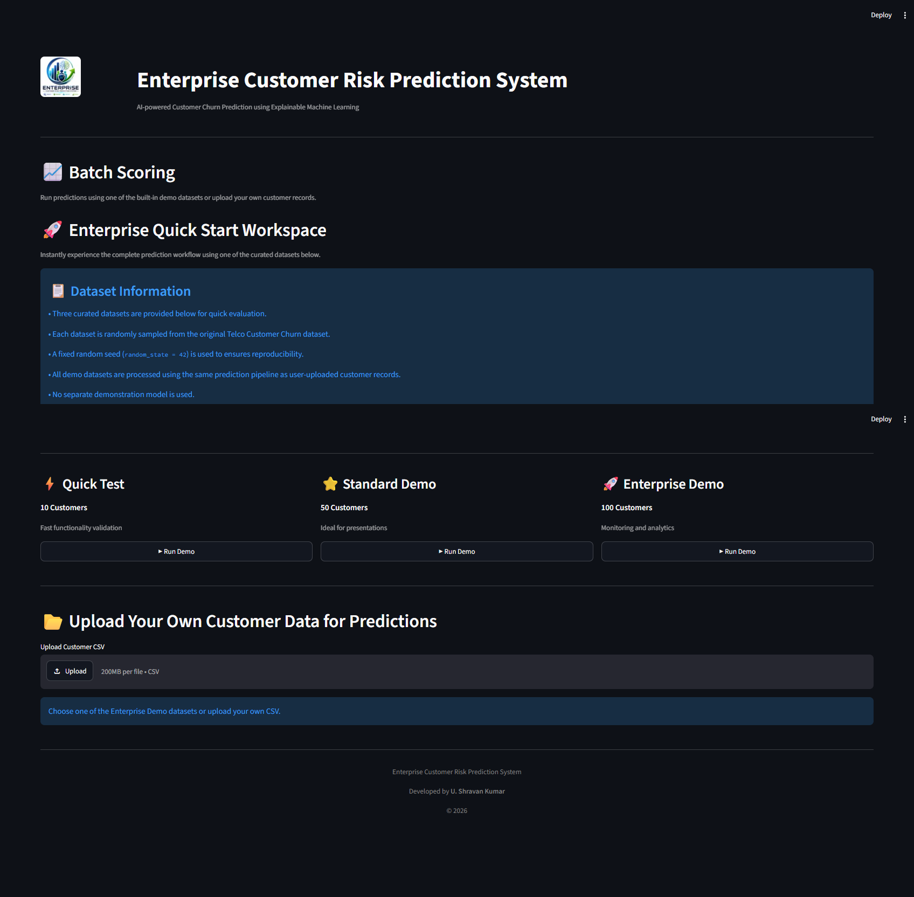
</p>

---

## Model Explainability

<p align="center">
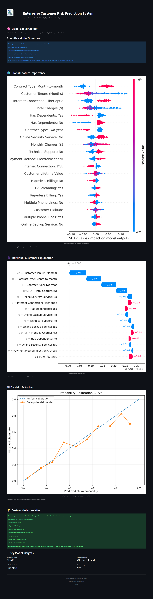
</p>

---

## Model Monitoring

<p align="center">
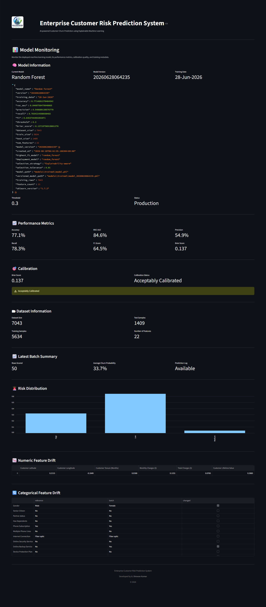
</p>

---

# Docker Deployment

The project is fully containerized using Docker and Docker Compose.

## Docker Architecture

<p align="center">
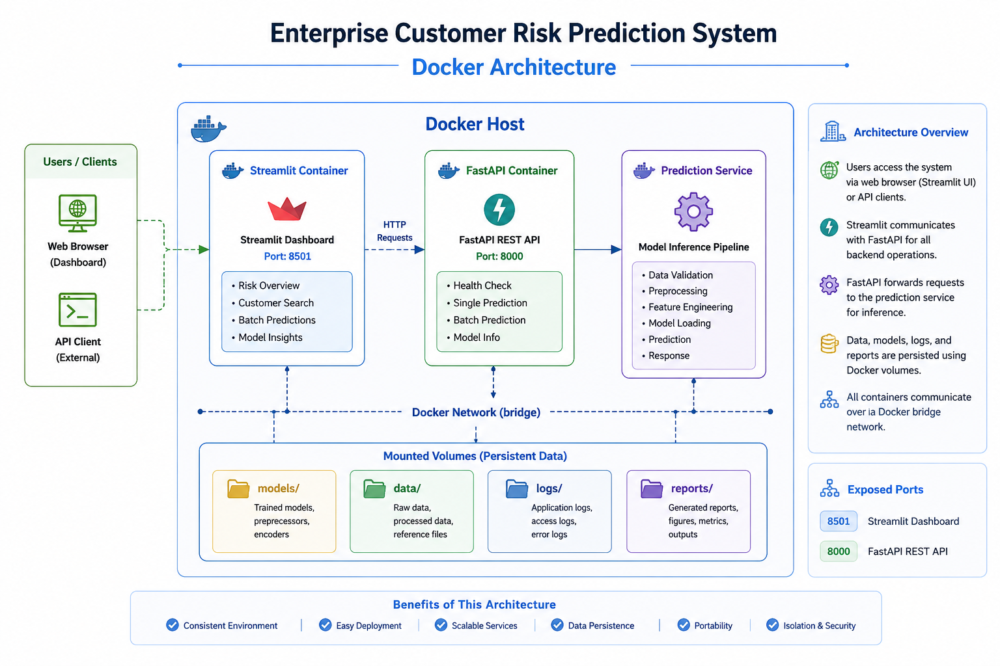
</p>

---

## Build Containers

```bash
docker compose build
```

---

## Start Services

```bash
docker compose up
```

---

## Start in Detached Mode

```bash
docker compose up -d
```

---

## Stop Services

```bash
docker compose down
```

---

## Services

| Service | Port |
|----------|------|
| FastAPI | 8000 |
| Streamlit | 8501 |

---


# Installation

## Clone Repository

```bash
git clone https://github.com/<your-username>/enterprise-customer-risk-prediction.git

cd enterprise-customer-risk-prediction
```

---

## Create Virtual Environment

### Windows

```powershell
python -m venv venv311

.\venv311\Scripts\activate
```

### Linux / macOS

```bash
python3 -m venv venv311

source venv311/bin/activate
```

---

## Install Dependencies

```bash
pip install -r requirements.txt
```

---

# Configuration

Project settings are managed through:

```text
src/config/settings.py
```

Optional environment variables may be configured using:

```text
.env
```

---

# Running the Project

## Train the Model

```bash
python scripts/train.py
```

---

## Run FastAPI

```bash
python scripts/serve_api.py
```

or

```bash
uvicorn api.main:app --reload
```

---

## Run Streamlit

```bash
python scripts/run_ui.py
```

or

```bash
streamlit run ui/streamlit_app.py
```

---

# Testing

Run all unit tests.

```bash
pytest
```

Generate test coverage.

```bash
pytest --cov=src
```

---

# Results

The project automatically generates:

- Champion model selection
- Performance comparison
- Threshold optimization
- Calibration analysis
- Business impact report
- SHAP explainability
- Prediction monitoring
- Executive risk summary
- Model metadata
- Deployment-ready artifacts

---

# Business Value

This solution enables organizations to:

- Identify high-risk customers early
- Improve customer retention
- Reduce revenue loss
- Support targeted retention campaigns
- Increase customer lifetime value
- Deliver explainable AI predictions
- Enable data-driven decision making

---

# Future Improvements

- Hyperparameter optimization using Optuna
- Cross-validation model selection
- Automated feature selection
- Model registry integration
- Data drift detection
- Model drift detection
- Automated retraining pipeline
- CI/CD using GitHub Actions
- Kubernetes deployment
- Cloud deployment on AWS, Azure, or GCP
- PostgreSQL integration
- User authentication and authorization
- Role-based dashboard access
- Real-time prediction service
- Kafka event streaming

---

# References

- IBM Telco Customer Churn Dataset
- Scikit-learn Documentation
- SHAP Documentation
- FastAPI Documentation
- Streamlit Documentation
- Docker Documentation

---

# License

This project is licensed under the **MIT License**.

See the `LICENSE` file for additional details.

---

# Acknowledgements

This project incorporates concepts and best practices from:

- Machine Learning
- Explainable AI (XAI)
- Software Engineering
- MLOps
- Production Machine Learning
- REST API Development
- Data Visualization

---

# Author

**U Shravan Kumar**

M.Sc. Data Science

Machine Learning Engineer Aspirant

### Connect

- GitHub: https://github.com/<your-github-username>
- LinkedIn: https://linkedin.com/in/<your-linkedin-profile>

---

# Repository Status

| Module | Status |
|---------|--------|
| Data Pipeline | ✅ |
| Feature Engineering | ✅ |
| Model Training | ✅ |
| Explainability | ✅ |
| Monitoring | ✅ |
| FastAPI | ✅ |
| Streamlit | ✅ |
| Docker | ✅ |
| Unit Testing | ✅ |
| Documentation | ✅ |

---

<p align="center">

**⭐ If you found this project useful, consider giving it a star on GitHub! ⭐**

</p>
````
