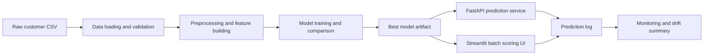
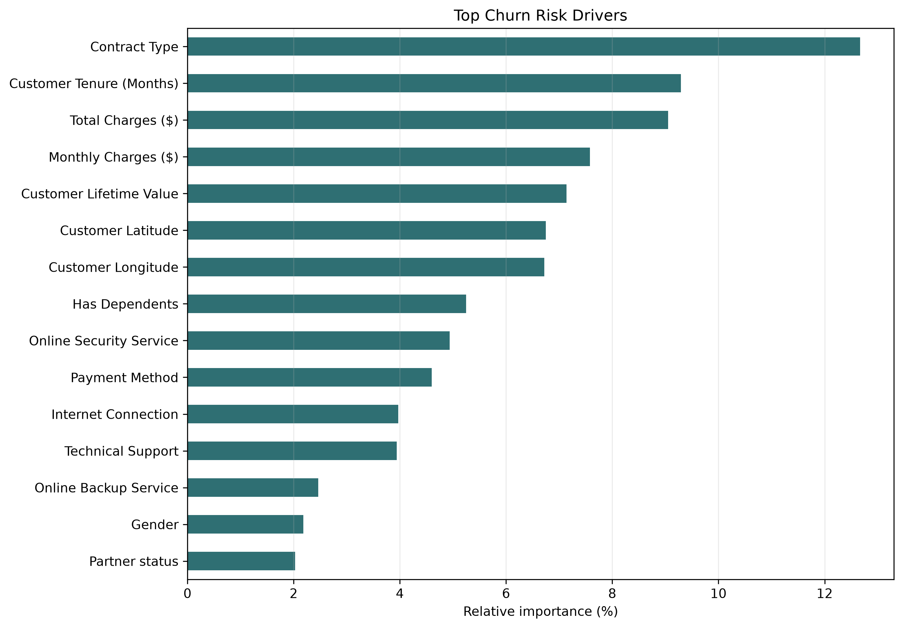

# Enterprise Customer Risk Prediction

## Project Report Draft

Submitted for M.Sc. Data Science, Semester IV.

## Declaration

This project, titled "Enterprise Customer Risk Prediction", is an original applied data science work focused on predicting telecom customer churn risk and supporting retention decisions with explainable machine learning.

## Acknowledgement

I acknowledge the academic guidance, open-source tools, and publicly available telecom churn dataset that made this project possible.

## Abstract

Customer churn creates direct revenue risk for telecom and subscription businesses. This project builds an end-to-end machine learning system that predicts whether a customer is likely to churn, estimates churn probability, assigns a risk band, explains the top risk drivers, and supports business users through an API and Streamlit interface. The system includes data validation, preprocessing, expanded model comparison including a neural-network baseline and gradient-boosted tabular models, threshold tuning, model persistence, prediction logging, monitoring, Docker deployment, and automated tests. The current best model by tuned F1 score is selected from the generated benchmark.

## 1. Introduction

Customer retention is more cost-effective than new customer acquisition. A churn prediction system helps teams identify high-risk customers early and prioritize outreach. The project converts raw customer demographic, service, billing, and value information into actionable churn risk predictions.

## 2. Problem Statement

The goal is to develop a reliable and explainable system that predicts customer churn risk from telecom customer records and presents the output in a form useful for business action.

## 3. Objectives

1. Build a reproducible ML pipeline for customer churn prediction.
2. Compare multiple machine learning models and select the best model using validation metrics.
3. Tune the classification threshold to balance precision and recall.
4. Provide customer-level risk bands and top risk drivers.
5. Expose predictions through FastAPI and Streamlit.
6. Add monitoring artifacts for batch scoring and drift visibility.
7. Package the system for local and Docker-based execution.

## 4. Scope

The system predicts churn for telecom customers using structured tabular data. It supports batch scoring, API inference, model metadata reporting, prediction logging, and model monitoring. Authentication, cloud deployment, and fully automated retraining are future enhancements.

## 5. Literature Review

Churn prediction is a common supervised classification problem in customer analytics. Logistic Regression provides interpretability and a strong baseline. Tree-based ensembles such as Random Forest and XGBoost often perform well on mixed numerical and categorical business data because they capture nonlinear interactions. Explainability and threshold selection are important because the business cost of missing a churner is usually higher than the cost of contacting a non-churner.

## 6. Dataset

The project uses the Telco customer churn dataset with 7,043 rows. Features include demographics, tenure, services, contract type, billing method, monthly charges, total charges, and customer lifetime value. The target column is `Churn Label`.

## 7. Methodology

The system follows this workflow:

1. Load raw data from `data/raw/Telco_customer_churn.csv`.
2. Preprocess numeric and categorical values.
3. Validate required columns, category values, and numeric ranges.
4. Build training features and target labels.
5. Split data into train and test sets.
6. Train Logistic Regression, Random Forest, Extra Trees, Gradient Boosting, HistGradientBoosting, AdaBoost, SVC-RBF, MLP Neural Network, XGBoost, LightGBM, and CatBoost when available.
7. Tune the classification threshold for F1 score.
8. Persist the best model and metadata.
9. Generate metrics, feature importance, confusion matrix, business impact, and figures.
10. Serve predictions through API and UI.

## 8. System Architecture



## 9. Model Results

Current best model by tuned F1 score:

| Metric | Value |
|---|---:|
| ROC-AUC | 0.8461 |
| Accuracy | 0.7715 |
| Precision | 0.5487 |
| Recall | 0.7834 |
| F1 | 0.6454 |
| Threshold | 0.30 |

Model comparison is stored at `reports/metrics/model_comparison.json`.

Expanded tuned model comparison:

| Model | ROC-AUC | Accuracy | Precision | Recall | F1 | Threshold |
|---|---:|---:|---:|---:|---:|---:|
| Logistic Regression | 0.8480 | 0.7743 | 0.5583 | 0.7166 | 0.6276 | 0.60 |
| Random Forest | 0.8461 | 0.7715 | 0.5487 | 0.7834 | 0.6454 | 0.30 |
| Extra Trees | 0.8235 | 0.7246 | 0.4880 | 0.7620 | 0.5950 | 0.25 |
| Gradient Boosting | 0.8506 | 0.7771 | 0.5625 | 0.7219 | 0.6323 | 0.35 |
| HistGradientBoosting | 0.8445 | 0.7324 | 0.4976 | 0.8396 | 0.6249 | 0.20 |
| AdaBoost | 0.8387 | 0.7885 | 0.5927 | 0.6497 | 0.6199 | 0.45 |
| SVC-RBF | 0.8366 | 0.7743 | 0.5553 | 0.7513 | 0.6386 | 0.35 |
| MLP Neural Network | 0.7920 | 0.7381 | 0.5052 | 0.6444 | 0.5664 | 0.25 |
| XGBoost | 0.8502 | 0.7743 | 0.5581 | 0.7193 | 0.6285 | 0.35 |
| LightGBM | 0.8485 | 0.7750 | 0.5576 | 0.7380 | 0.6352 | 0.50 |
| CatBoost | 0.8520 | 0.7800 | 0.5681 | 0.7139 | 0.6327 | 0.60 |

CatBoost achieved the highest ROC-AUC, but Random Forest was selected because it achieved the highest tuned F1 score and strong recall, which is more suitable for retention campaign targeting.

## 10. Explainability

The project generates global feature importance at `reports/metrics/feature_importance.json` and customer-level top risk drivers in API/UI prediction responses. This allows a business user to understand why a customer is predicted as high risk.

Generated figure:



## 11. Business Impact

The project estimates campaign value using customer lifetime value, model ranking, assumed retention success rate, and outreach cost. The business impact report is stored at `reports/metrics/business_impact.json`.

Example business questions answered:

1. What percentage of churners are captured by targeting the top 10%, 20%, or 30% highest-risk customers?
2. What is the estimated customer lifetime value at risk?
3. What is the estimated net value of a retention campaign?

## 12. Testing

Automated tests cover API behavior, data loading, preprocessing, monitoring, and training pipeline components.

Latest verified result:

```text
18 passed
```

## 13. Implementation

Main components:

| Component | Purpose |
|---|---|
| `src/data` | Data loading, validation, splitting |
| `src/features` | Preprocessing and feature building |
| `src/models` | Training, evaluation, explainability, business impact |
| `src/pipelines` | Training and inference workflows |
| `api` | FastAPI service |
| `ui` | Streamlit batch scoring application |
| `reports` | Metrics, monitoring, figures, and report artifacts |
| `tests` | Automated test suite |

## 14. Deployment

The system can run locally or through Docker Compose.

```powershell
python scripts/train.py
python scripts/serve_api.py
python scripts/run_ui.py
docker compose up --build
```

## 15. Findings

1. Churn prediction is feasible with strong discrimination, as shown by ROC-AUC above 0.84.
2. Lowering the threshold to 0.30 improves recall, which is appropriate when the business wants to catch more potential churners.
3. Explainable risk drivers make the model more useful for retention teams.
4. Monitoring and batch summaries make the project stronger than a notebook-only solution.

## 16. Limitations

1. The current dataset is static and historical.
2. Campaign success assumptions need validation with real business outcomes.
3. Full SHAP explanations are not yet included.
4. Authentication and production request limits are future deployment requirements.

## 17. Future Scope

1. Add SHAP-based local explanations.
2. Add probability calibration.
3. Add automated retraining triggers based on drift.
4. Deploy to a cloud platform with authentication.
5. Add A/B testing support for retention campaigns.

## 18. Conclusion

The project is a complete applied machine learning system for enterprise customer risk prediction. It goes beyond model training by adding explainability, business impact analysis, API/UI deployment, monitoring, Docker support, and automated testing. With final formatting into the university report template, it is suitable for a strong Semester IV submission.

## References

1. Scikit-learn documentation.
2. FastAPI documentation.
3. Streamlit documentation.
4. XGBoost documentation.
5. Telco customer churn dataset documentation.
